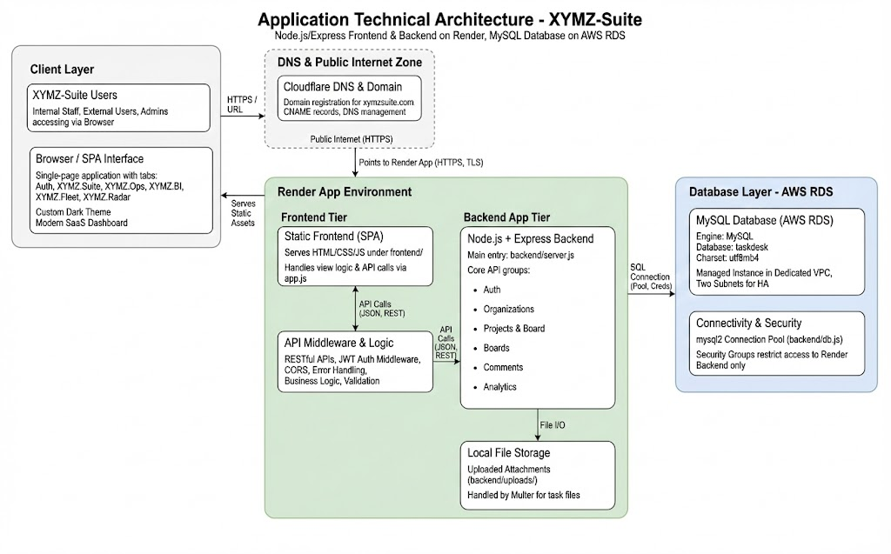
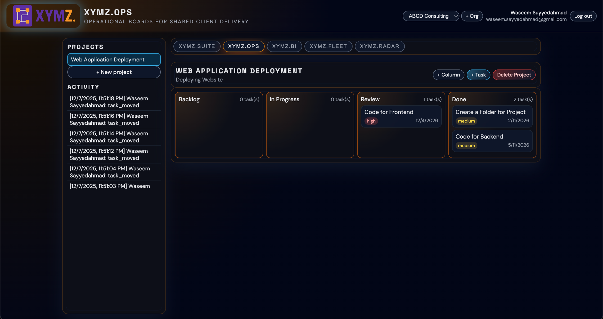
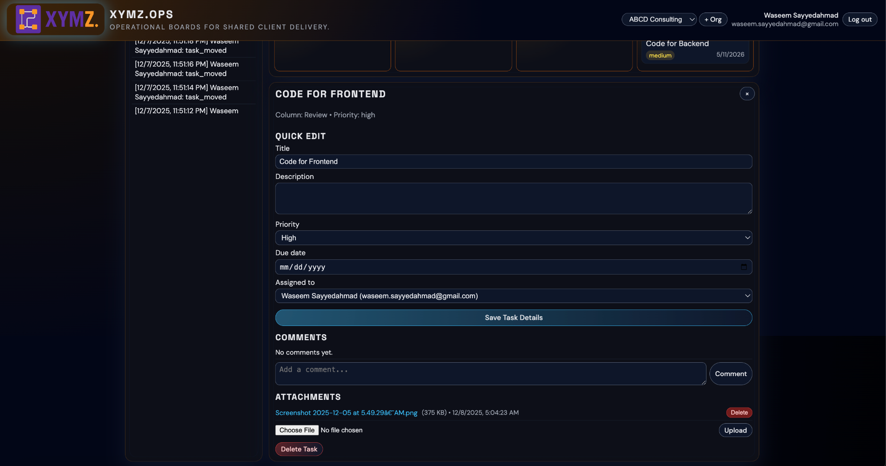
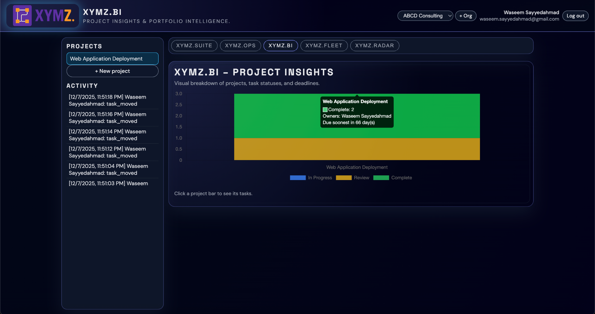
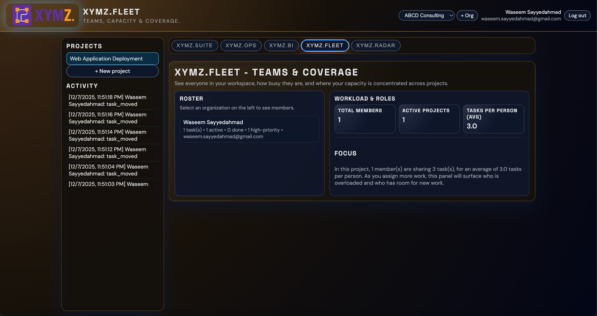
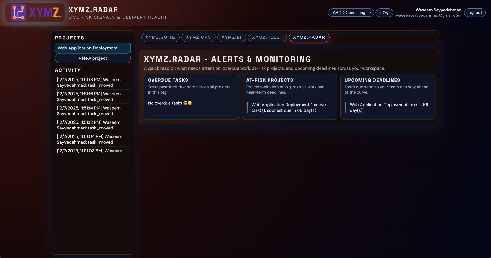

<h1 align="center">XYMZ.Suite</h1>

<p align="center">
  <strong>Shared workspaces for agencies &amp; clients – projects, insights, teams, and risk, all in one place.</strong>
</p>

<p align="center">
  
</p>

<p align="center">
  <a href="https://nodejs.org/">
    
  </a>
  <a href="https://aws.amazon.com/rds/">
    
  </a>
  <a href="https://render.com/">
    
  </a>
  <a href="https://cloudflare.com/">
    
  </a>
</p>

---

## 📚 Table of Contents

1. [Overview](#overview)  
2. [Key Features](#key-features)  
3. [System Architecture](#system-architecture)  
4. [Screenshots &amp; UI Tour](#screenshots--ui-tour)  
5. [How the Workspace Works](#how-the-workspace-works)  
6. [Database Schema](#database-schema)  
7. [Table Summary](#table-summary)  
8. [Tech Stack](#tech-stack)  
9. [Project Structure](#project-structure)  
10. [Running the Project](#running-the-project)  
11. [References &amp; Inspiration](#-references--inspiration)  
12. [Acknowledgements](#acknowledgements)  

---

## 💡 Overview

**XYMZ.Suite** is a full-stack web application that gives agencies, consultants, and small teams a shared workspace for client projects.

It combines:

- **XYMZ.Suite** – landing &amp; overview hub  
- **XYMZ.Ops** – Kanban boards and day-to-day delivery  
- **XYMZ.BI** – simple project &amp; task analytics  
- **XYMZ.Fleet** – team capacity and workload overview  
- **XYMZ.Radar** – risk, deadlines, and alerts  

### 🚀 Deployment

- **Backend API + Static Frontend**  
  Deployed on **Render** as a Node.js service (Express). HTTPS is handled by Render with an automatically provisioned TLS certificate for the custom domain.

- **Database**  
  **MySQL** hosted on **AWS RDS**, inside a dedicated **VPC** with two subnets for high availability and network isolation.

- **Domain &amp; DNS**  
  Custom domain **`xymzsuite.com`** purchased and managed on **Cloudflare**, with:
  - `www.xymzsuite.com` → CNAME to Render service  
  - `xymzsuite.com` → CNAME / root mapping to Render service  

---

## ✨ Key Features

### 🔐 Authentication &amp; Security

- Email + password authentication  
- Passwords stored as **bcrypt hashes**  
- Security question + answer stored as hashes for password recovery  
- Optional **6-digit organization token** on login to route users into the correct workspace  
- **JWT-based** session tokens on the backend  

---

### 🧭 Organizations &amp; Workspaces

- Create a new organization as an **admin**, or join an existing one via a 6-digit **join token**  
- Each user can belong to **multiple organizations**  
- Top-bar **organization switcher** to move between workspaces  

---

### 📌 Projects &amp; Kanban Boards (XYMZ.Ops)

Per organization you can create multiple projects, each with its own Kanban board:

- Customizable **columns** (Backlog, In Progress, Review, Done, etc.)  
- **Tasks** inside columns with drag-and-drop movement  

For each task:

- Title &amp; description  
- Priority (low / medium / high)  
- Due date  
- Assignment to a member  
- Comments thread  
- File attachments (upload, download, delete via the backend)  

---

### 📊 Analytics (XYMZ.BI)

- Project-level **dashboard**:
  - Stacked bar chart of task statuses:
    - In Progress  
    - Review  
    - Complete  
  - Hover tooltips show owners and upcoming deadlines  

- Task-level **drilldown**:
  - Bar chart of **days left** per task  
  - Quickly see which tasks are close to their deadline  

---

### 👥 Team Capacity (XYMZ.Fleet)

- Roster of members in the current organization  
- Summary cards with:
  - Total members  
  - Active projects  
  - Average tasks per person  
- Narrative **Focus** panel that explains who may be overloaded and who has room for more work  

---

### 🚨 Delivery Risk &amp; Alerts (XYMZ.Radar)

Three panels give a one-glance health check:

- **Overdue Tasks**  
- **At-Risk Projects**  
- **Upcoming Deadlines**  

Uses due dates and task states to surface what needs immediate attention across the workspace.

---

## 🏗️ System Architecture

<p align="center">
  
</p>

### 🎨 Frontend

- Static **HTML/CSS/JavaScript** frontend under `frontend/`  
- Single-page style interface with views controlled by tabs:
  - Auth (Login / Sign-up)  
  - XYMZ.Suite  
  - XYMZ.Ops  
  - XYMZ.BI  
  - XYMZ.Fleet  
  - XYMZ.Radar  

- Custom branding:
  - XYMZ logo  
  - Dark theme palette  
  - Clean typographic hierarchy  

- Layout inspired by modern dark SaaS dashboards:
  - Multi-panel layout  
  - Accent borders  
  - Subtle glow / neon-style focus states  

---

### 🛠️ Backend (Node.js + Express)

Main entry: `backend/server.js`  

Core API groups (all prefixed with `/api`):

- **Auth**
  - `POST /api/auth/register` – create user (+ optional organization for admins)  
  - `POST /api/auth/login` – authenticate &amp; issue JWT  
  - `GET /api/auth/security-question` – fetch stored security question by email  
  - `POST /api/auth/reset-password` – security-question-based password reset  
  - `POST /api/auth/reset-org-token` – reset the 6-digit organization token (admin)

- **Organizations &amp; Membership**
  - `GET /api/me` – current user + organizations  
  - `GET /api/orgs` – list organizations the user belongs to  
  - `POST /api/orgs` – create a new organization  
  - `POST /api/orgs/join-token` – join an organization via 6-digit token  

- **Projects &amp; Board**
  - `GET /api/orgs/:orgId/projects` – list projects in an org  
  - `POST /api/orgs/:orgId/projects` – create a project  
  - `DELETE /api/projects/:projectId` – delete a project (with cascade in DB)  
  - `GET /api/projects/:projectId/board` – full Kanban board (columns + tasks + members)  
  - `POST /api/projects/:projectId/columns` – add a new column  
  - `POST /api/projects/:projectId/tasks` – create task  
  - `PUT /api/tasks/:taskId` – update task fields  
  - `PATCH /api/tasks/:taskId/move` – drag-and-drop movement across columns  
  - `DELETE /api/tasks/:taskId` – delete task  

- **Comments &amp; Attachments**
  - `GET /api/tasks/:taskId/comments` – list comments for a task  
  - `POST /api/tasks/:taskId/comments` – add a comment  
  - `GET /api/tasks/:taskId/attachments` – list attachments for a task  
  - `POST /api/tasks/:taskId/attachments` – upload a file attachment  
  - `DELETE /api/tasks/:taskId/attachments/:attachmentId` – delete an attachment  
  - `GET /api/attachments/:attachmentId/download` – download a file attachment  

- **Analytics / Insights**
  - `GET /api/orgs/:orgId/bi-summary` – project-level BI summary  
  - `GET /api/projects/:projectId/bi-tasks` – task list with days-left calculation  
  - `GET /api/orgs/:orgId/activity` – recent activity feed  
  - `GET /api/orgs/:orgId/fleet` – member roster &amp; roles  
  - `GET /api/orgs/:orgId/radar` – org-wide risk &amp; delivery health snapshot  

**Middleware Stack**

- CORS  
- JSON body parsing (`express.json`)  
- JWT auth middleware (protects application routes)  
- Multer for file uploads to `backend/uploads/`  
- Error handler for unexpected server errors  

---

### 🗄️ Database

- Engine: **MySQL** (AWS RDS)  
- Database name: `taskdesk` (configurable)  
- Charset &amp; collation: **`utf8mb4` / `utf8mb4_unicode_ci`** for full Unicode support  

**Connectivity**

- Node backend uses **mysql2** with a connection pool (`backend/db.js`)  
- Credentials and host are configured via environment variables on the Render backend service  

---

### ☁️ Hosting Topology

- **Render**
  - Runs the Node.js backend  
  - Serves the frontend assets  
  - Handles HTTPS with auto TLS certificates  

- **AWS RDS**
  - MySQL inside a dedicated **VPC**  
  - Two subnets for high availability  
  - Security groups restrict access to the backend only  

- **Cloudflare**
  - Domain registration for `xymzsuite.com`  
  - DNS (CNAME) records for `xymzsuite.com` and `www`  
  - Works alongside Render’s TLS for secure browsing  

---

## 🖼️ Screenshots &amp; UI Tour
 
> The layout below uses a **2-column grid** displaying a visual, portfolio-style presentation.

<table>
  <tr>
    <td align="center" width="50%">
      <br/>
      <strong>Auth – Login &amp; Sign Up</strong><br/>
      Jump into XYMZ with a clean, focused auth screen and clear call-to-action tiles.
    </td>
    <td align="center" width="50%">
      <br/>
      <strong>XYMZ.Suite – Welcome / Landing</strong><br/>
      Overview hub with projects, recent activity, and quick links into the rest of the suite.
    </td>
  </tr>
  <tr>
    <td align="center">
      <br/>
      <strong>XYMZ.Ops – Kanban Board</strong><br/>
      Drag-and-drop board for daily delivery: backlog, in-progress, review, and done.
    </td>
    <td align="center">
      <br/>
      <strong>Task Detail – Quick Edit, Comments &amp; Attachments</strong><br/>
      Side-panel editor with priority, due date, assignee, task discussion thread, and a full attachments area (upload, download, remove files).
    </td>
  </tr>
  <tr>
    <td align="center">
      <br/>
      <strong>XYMZ.BI – Project Insights</strong><br/>
      Stacked bar charts for each project, showing in-progress, review, and completed work.
    </td>
    <td align="center">
      <br/>
      <strong>XYMZ.BI – Task Drilldown</strong><br/>
      Days-left view of tasks to spotlight what's urgent and what's safely on track.
    </td>
  </tr>
  <tr>
    <td align="center">
      <br/>
      <strong>XYMZ.Fleet – Team &amp; Workload</strong><br/>
      Team roster plus workload metrics so you can see who’s overloaded and who’s free.
    </td>
    <td align="center">
      <br/>
      <strong>XYMZ.Radar – Risk &amp; Alerts</strong><br/>
      At-a-glance overdue tasks, at-risk projects, and upcoming deadlines across the portfolio.
    </td>
  </tr>
</table>

---

## 🔁 How the Workspace Works

### 1. Authentication Flow

**Screenshot:** Auth – Login &amp; Sign Up

New users can sign up with:

- Name  
- Email  
- Password (minimum 6 characters)  
- Security question + answer  
- Optional checkbox: **“I will be an admin (create an organization)”**  

Admin users automatically:

- Create their first organization  
- Define a unique 6-digit **organization token**  

Regular users can later join an existing organization using this token.

**Login requires:**

- Email  
- Password  
- Optional organization token (helps route the user into the correct workspace)  

**Links:**

- **Forgot password?** – triggers security-question-based recovery  
- **Reset 6-digit token** – issues a new organization token for admins  

---

### 2. XYMZ.Suite – Welcome Hub

**Screenshot:** XYMZ.Suite – Welcome / Landing View

**Left sidebar:**

- **Projects list** for the current organization  
- **Activity feed** with recent actions (`task_moved`, new tasks, comments, etc.)  

**Top navigation:**

- XYMZ app selector tabs:  
  - `XYMZ.Suite`, `XYMZ.Ops`, `XYMZ.BI`, `XYMZ.Fleet`, `XYMZ.Radar`  
- Organization dropdown (for example, `ABCD Consulting`)  
- User chip showing **name + email** and a **Log out** button  

**Main content:**

- Welcome text explaining how to use the suite  
- **About XYMZ** panel  
- **FAQs** panel ready for additional content  
- **Contact** panel (email &amp; phone)  
- **Social** icons (Instagram, X, LinkedIn, Facebook)  

This page is the “home base” where users land after logging in.

---

### 3. XYMZ.Ops – Project Kanban

**Screenshots:** XYMZ.Ops – Kanban Board, Task Detail – Quick Edit, Comments &amp; Attachments

**Top section:**

- Project name (for example, `WEB APPLICATION DEPLOYMENT`)  
- Project description line  
- Actions: **+ Column**, **+ Task**, **Delete Project**  

**Board layout:**

- Each column represents a stage: **Backlog**, **In Progress**, **Review**, **Done**  
- Columns show the number of tasks in the header  
- Each task card displays:
  - Title  
  - Priority  
  - Due date  

**Interaction:**

- Clicking a task opens the **Quick Edit panel** on the right:
  - Edit title, description, priority, due date, assignee  
  - Save Task Details button  
  - Comments section:
    - Add new comments  
    - View full discussion history  
  - Attachments section:
    - Upload files via the built-in file uploader  
    - See a list of existing attachments (name, size)  
    - Download or delete attachments directly from the task  
  - Delete Task button  

All column and task changes are persisted in MySQL, and actions are tracked in the `activity_log` table.

---

### 4. XYMZ.BI – Project Insights &amp; Task Drilldown

**Screenshots:** XYMZ.BI – Project Insights, XYMZ.BI – Task Drilldown

**Top chart: PROJECT INSIGHTS**

- Stacked bar per project:
  - In Progress  
  - Review  
  - Complete  

Tooltip summaries include:

- Completed task count  
- Owners / assignees  
- Soonest due date  

**Bottom chart: TASKS – [Project Name]**

- Bar chart showing **days left** per task  
- Quickly reveals which tasks are approaching their deadlines  

Data comes from `projects`, `tasks`, and `org_members` via aggregation queries.

---

### 5. XYMZ.Fleet – Teams &amp; Coverage

**Screenshot:** XYMZ.Fleet – Team &amp; Workload

**Roster panel:**

- Lists members in the selected organization  
- Shows each member’s email and task counts  

**Workload &amp; Roles:**

- Total members  
- Active projects  
- Average tasks per person  

**Focus panel:**

- Narrative explanation of current capacity (for example, “1 member(s) are sharing 3 task(s)”)  

This view makes it easy to see whether workload is balanced or if someone is overloaded.

---

### 6. XYMZ.Radar – Alerts &amp; Monitoring

**Screenshot:** XYMZ.Radar – Risk &amp; Alerts

- **Overdue Tasks**  
  - Tasks past their due date across all projects  
- **At-Risk Projects**  
  - Projects with a lot of in-progress work and near-term deadlines  
- **Upcoming Deadlines**  
  - Tasks with due dates approaching soon  

Each panel summarizes counts and dates, using task `due_date` and column-based status signals.

---

## 🧮 Database Schema

The database is implemented in **MySQL** with the following schema:

```sql
-- USERS
CREATE TABLE IF NOT EXISTS users (
  id INT AUTO_INCREMENT PRIMARY KEY,
  email VARCHAR(255) NOT NULL UNIQUE,
  name VARCHAR(255) NOT NULL,
  password_hash VARCHAR(255) NOT NULL,
  security_question VARCHAR(255),
  security_answer_hash VARCHAR(255),
  created_at DATETIME NOT NULL
);

-- ORGANIZATIONS
CREATE TABLE IF NOT EXISTS organizations (
  id INT AUTO_INCREMENT PRIMARY KEY,
  name VARCHAR(255) NOT NULL,
  owner_user_id INT NOT NULL,
  join_token VARCHAR(6) UNIQUE,
  created_at DATETIME NOT NULL,
  CONSTRAINT fk_org_owner
    FOREIGN KEY (owner_user_id) REFERENCES users(id)
    ON DELETE CASCADE
);

-- ORG MEMBERS
CREATE TABLE IF NOT EXISTS org_members (
  org_id INT NOT NULL,
  user_id INT NOT NULL,
  role VARCHAR(50) NOT NULL DEFAULT 'owner',
  invited_at DATETIME NOT NULL,
  PRIMARY KEY (org_id, user_id),
  CONSTRAINT fk_org_members_org
    FOREIGN KEY (org_id) REFERENCES organizations(id)
    ON DELETE CASCADE,
  CONSTRAINT fk_org_members_user
    FOREIGN KEY (user_id) REFERENCES users(id)
    ON DELETE CASCADE
);

-- PROJECTS
CREATE TABLE IF NOT EXISTS projects (
  id INT AUTO_INCREMENT PRIMARY KEY,
  org_id INT NOT NULL,
  name VARCHAR(255) NOT NULL,
  description TEXT,
  status VARCHAR(50) NOT NULL DEFAULT 'active',
  created_at DATETIME NOT NULL,
  CONSTRAINT fk_projects_org
    FOREIGN KEY (org_id) REFERENCES organizations(id)
    ON DELETE CASCADE
);

-- PROJECT COLUMNS
CREATE TABLE IF NOT EXISTS project_columns (
  id INT AUTO_INCREMENT PRIMARY KEY,
  project_id INT NOT NULL,
  name VARCHAR(255) NOT NULL,
  position INT NOT NULL,
  created_at DATETIME NOT NULL,
  CONSTRAINT fk_columns_project
    FOREIGN KEY (project_id) REFERENCES projects(id)
    ON DELETE CASCADE
);

-- TASKS
CREATE TABLE IF NOT EXISTS tasks (
  id INT AUTO_INCREMENT PRIMARY KEY,
  project_id INT NOT NULL,
  column_id INT NOT NULL,
  title VARCHAR(255) NOT NULL,
  description TEXT,
  priority VARCHAR(50) NOT NULL DEFAULT 'medium',
  position INT NOT NULL,
  due_date DATETIME NULL,
  assigned_to INT NULL,
  created_at DATETIME NOT NULL,
  CONSTRAINT fk_tasks_project
    FOREIGN KEY (project_id) REFERENCES projects(id)
    ON DELETE CASCADE,
  CONSTRAINT fk_tasks_column
    FOREIGN KEY (column_id) REFERENCES project_columns(id)
    ON DELETE CASCADE,
  CONSTRAINT fk_tasks_assigned_to
    FOREIGN KEY (assigned_to) REFERENCES users(id)
    ON DELETE SET NULL
);

-- COMMENTS
CREATE TABLE IF NOT EXISTS comments (
  id INT AUTO_INCREMENT PRIMARY KEY,
  task_id INT NOT NULL,
  user_id INT NOT NULL,
  body TEXT NOT NULL,
  created_at DATETIME NOT NULL,
  CONSTRAINT fk_comments_task
    FOREIGN KEY (task_id) REFERENCES tasks(id)
    ON DELETE CASCADE,
  CONSTRAINT fk_comments_user
    FOREIGN KEY (user_id) REFERENCES users(id)
    ON DELETE CASCADE
);

-- ACTIVITY_LOG
CREATE TABLE IF NOT EXISTS activity_log (
  id INT AUTO_INCREMENT PRIMARY KEY,
  org_id INT NOT NULL,
  user_id INT NULL,
  type VARCHAR(100) NOT NULL,
  payload_json TEXT,
  created_at DATETIME NOT NULL,
  CONSTRAINT fk_activity_org
    FOREIGN KEY (org_id) REFERENCES organizations(id)
    ON DELETE CASCADE,
  CONSTRAINT fk_activity_user
    FOREIGN KEY (user_id) REFERENCES users(id)
    ON DELETE SET NULL
);

-- ATTACHMENTS
CREATE TABLE IF NOT EXISTS attachments (
  id INT AUTO_INCREMENT PRIMARY KEY,
  task_id INT NOT NULL,
  filename VARCHAR(255) NOT NULL,
  original_name VARCHAR(255) NOT NULL,
  mime_type VARCHAR(255) NOT NULL,
  size INT NOT NULL,
  created_at DATETIME NOT NULL,
  CONSTRAINT fk_attachments_task
    FOREIGN KEY (task_id) REFERENCES tasks(id)
    ON DELETE CASCADE
);
```

---

## 🗂️ Table Summary

<p align="center">
  
</p>

- **users** – application users with password &amp; security-answer hashes  
- **organizations** – client workspaces; each has an owner and a 6-digit join token  
- **org_members** – many-to-many mapping between users and organizations, with roles  
- **projects** – projects within an organization  
- **project_columns** – Kanban list columns per project  
- **tasks** – individual tasks, linked to a project and column, with assignee and due date  
- **comments** – discussion thread on each task  
- **activity_log** – timeline of events across an organization  
- **attachments** – metadata for files uploaded to a task  

---

## 🧱 Tech Stack

### Frontend

- HTML5, CSS3  
- Vanilla JavaScript  

### Backend

- Node.js  
- Express.js  
- JSON Web Tokens (JWT)  
- Multer (file uploads)  
- bcryptjs (password hashing)  

### Database

- MySQL (AWS RDS)  
- mysql2 (Node client)  

### Infrastructure

- Render – app hosting  
- AWS RDS – managed MySQL  
- Cloudflare – domain &amp; DNS  

---

## 📁 Project Structure

```text
XYMZ-Suite/
├── backend/
│   ├── server.js          # Express app & API routes
│   ├── db.js              # MySQL connection pool & helpers
│   ├── package.json
│   ├── package-lock.json
│   ├── uploads/           # Uploaded task attachments
│   └── .env               # Backend configuration (not committed)
├── frontend/
│   ├── index.html         # Main SPA shell
│   ├── js/
│   │   └── app.js         # Frontend logic & API calls
│   ├── css/               # Stylesheets (dark theme, layout)
│   └── img/               # Logo and other assets
└── README.md
```

---

## 🏃‍♂️ Running the Project

This is a simplified overview of how the app is run locally or on a new environment.

### 1. Clone the repository

```bash
git clone https://github.com/<your-username>/XYMZ-Suite.git
cd XYMZ-Suite/backend
```

### 2. Install backend dependencies

```bash
npm install
```

### 3. Create the MySQL database

- Create a new empty database (e.g., `taskdesk`) in MySQL.  
- Run the SQL from the **Database Schema** section against that database.

### 4. Configure backend environment

- Create a `.env` file in `backend/` with your own values (JWT secret, DB host/user/password/name, port, etc.).  
- Keep this file out of version control.

### 5. Start the backend

```bash
npm start
```

### 6. Open the frontend

- Serve `frontend/index.html` using a simple static server (VS Code Live Server, `http-server`, or by configuring Express to serve the `frontend` folder).  
- Log in or sign up and start using **XYMZ.Suite**.

---

## 📎 References &amp; Inspiration

> These were the main external resources used for learning patterns, APIs, and design ideas that influenced this project. The XYMZ.Suite codebase is heavily customized on top of these references.

### Backend &amp; API Design

- **Node.js + MySQL CRUD Tutorial (YouTube)** – *Node.js + MySQL CRUD - GET, POST, PUT and DELETE*  
  https://www.youtube.com/watch?v=8UMd_RIfNU4

- **Node.js + Express + MySQL REST API (YouTube)** – *Learn Node JS with MySQL APIs Development Beginners*  
  https://www.youtube.com/watch?v=na9sbI4YQ3A

- **Express + MySQL Sample Repo (GitHub)** – *Node.js Rest APIs with Express &amp; MySQL* by bezkoder  
  https://github.com/bezkoder/nodejs-express-mysql

### Frontend (fetch, JS, and layout)

- **Fetch API Docs (MDN Web Docs)** – official reference for `fetch()` usage and patterns  
  https://developer.mozilla.org/en-US/docs/Web/API/Fetch_API/Using_Fetch

- **Vanilla JS &amp; DOM Patterns (MDN Web Docs)** – event handling, DOM updates, and async logic  
  https://developer.mozilla.org/en-US/docs/Web/JavaScript

- **Dark Dashboard &amp; Admin UI Inspiration**  
  - Tailwind CSS examples and component ideas – https://tailwindcss.com/components  
  - Dark dashboard layouts and cards – https://dribbble.com/tags/dark_dashboard  

### CSS Templates &amp; UI Ideas

- General structure and spacing ideas from modern admin templates:  
  - https://themes.getbootstrap.com/  
  - https://www.creative-tim.com/bootstrap-themes/admin-dashboard  
  - https://uideck.com/

### ChatGPT Code Generation &amp; Refactors

- **ChatGPT (OpenAI)** – assisted in brainstorming UI wording, tightening Express route structure, and drafting parts of this README.  
  https://chat.openai.com/  


---

## 🙏 Acknowledgements

- Frontend layout and dark-dashboard look inspired by modern SaaS admin templates and design patterns.  
- Infrastructure design informed by common three-tier web app practices (Render + AWS RDS + Cloudflare).
